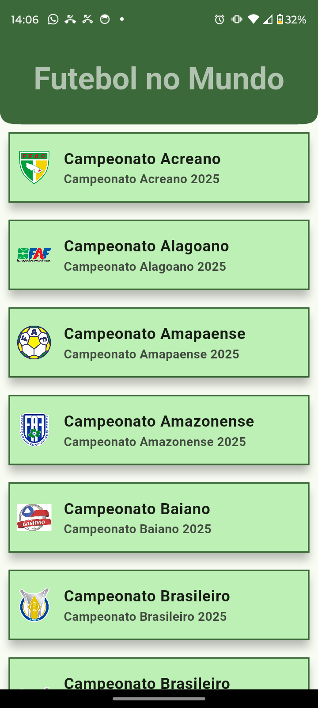
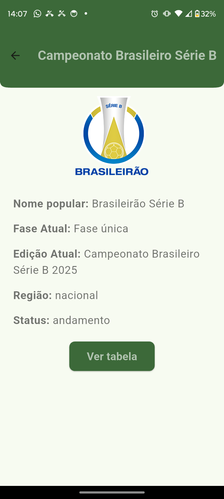
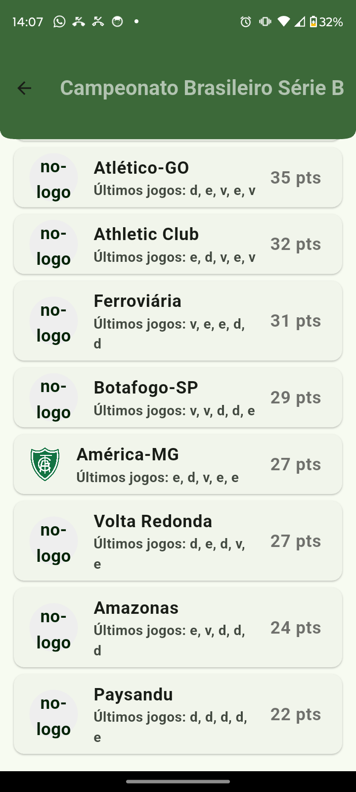
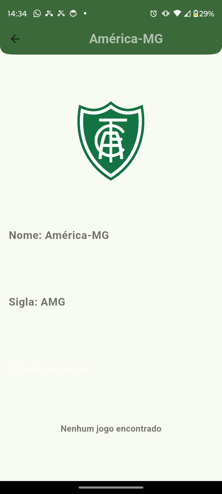
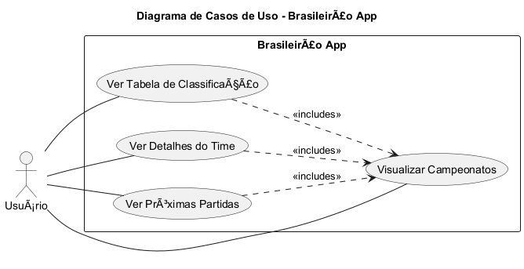
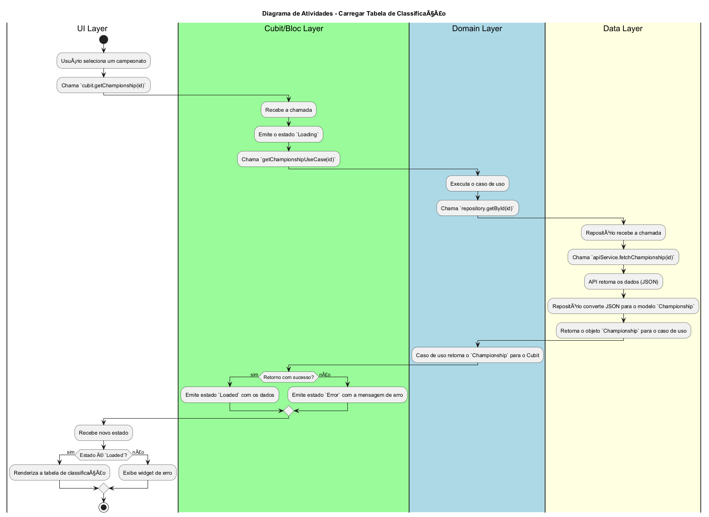
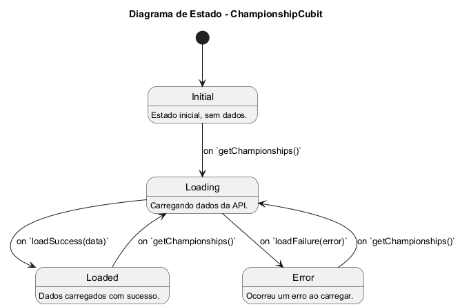
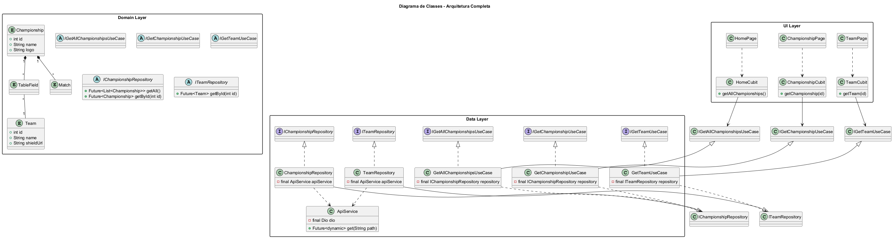

# Brasileirão Info App

Um aplicativo Flutter que exibe informações em tempo real sobre campeonatos de futebol, com foco no Brasileirão, utilizando a API da [api-futebol.com.br](https://www.api-futebol.com.br/).

## 🎯 Visão Geral

Este projeto é um aplicativo Flutter multiplataforma (Android, iOS, Web, Desktop) que demonstra os princípios da Arquitetura Limpa. Ele consome dados de uma API de futebol para exibir detalhes sobre campeonatos, times e tabelas de classificação.

## ✨ Recursos

- **Visualização de Campeonatos:** Veja a lista dos principais campeonatos de futebol.
- **Tabela de Classificação:** Acompanhe a classificação dos times no campeonato selecionado.
- **Detalhes do Time:** Veja informações detalhadas sobre um time específico.
- **Arquitetura Limpa:** O projeto segue uma arquitetura robusta para garantir a separação de responsabilidades e a testabilidade.
- **Gerenciamento de Estado:** Utiliza `flutter_bloc` para um gerenciamento de estado eficiente e previsível.
- **Injeção de Dependência:** Usa `get_it` para desacoplar as dependências do projeto.
- **Configuração Segura:** Gerencia chaves de API de forma segura usando variáveis de ambiente com `flutter_dotenv`.

## 📸 Screenshots

<p align="center">
  
  
  
  
</p>

## 📂 Arquitetura do Projeto

O projeto é estruturado com base nos princípios da Arquitetura Limpa, dividindo o código em três camadas principais:

- **`domain`**: A camada mais interna e o núcleo do aplicativo. Contém a lógica de negócios, entidades e os contratos (interfaces) para os casos de uso e repositórios.
- **`data`**: A camada que implementa os contratos definidos no `domain`. É responsável por buscar dados de fontes externas (API, banco de dados local, etc.).
- **`ui`**: A camada de apresentação. Contém todos os widgets do Flutter, as telas e a lógica de apresentação (usando `flutter_bloc`).

## 📐 Diagramas de Arquitetura

Os diagramas abaixo foram gerados com PlantUML para documentar visualmente a arquitetura e os fluxos do projeto.

### Diagrama de Casos de Uso

Mostra as principais interações do usuário com o sistema.



### Diagrama de Atividades

Detalha o fluxo para carregar a tabela de classificação de um campeonato.



### Diagrama de Estado

Modela os estados do `ChampionshipCubit` durante a busca de dados.



### Diagrama de Classes

Descreve a estrutura das classes nas camadas de UI, Domain e Data.



## dependencies-chave

- **`flutter`**: Framework para construir a interface do usuário.
- **`http`** & **`dio`**: Clientes HTTP para fazer chamadas à API REST.
- **`flutter_bloc`**: Para gerenciamento de estado.
- **`get_it`**: Service Locator para injeção de dependências.
- **`flutter_dotenv`**: Para carregar variáveis de ambiente de forma segura.

## 🚀 Como Começar

Siga as instruções abaixo para configurar e executar o projeto localmente.

### Pré-requisitos

- [Flutter SDK](https://flutter.dev/docs/get-started/install)
- Um editor de código (VS Code, Android Studio, etc.)

### Instalação e Execução

1.  **Clone o repositório:**
    ```sh
    git clone https://github.com/DanielBrown1998/api_rest_brasileirao.git
    cd api_rest_brasileirao
    ```

2.  **Instale as dependências:**
    ```sh
    flutter pub get
    ```

3.  **Configure a Chave da API (via .env)**
    Este projeto gerencia as chaves de API usando um arquivo `.env`.

    a. Na raiz do projeto, crie um arquivo chamado `.env`.

    b. Adicione sua chave de API da [api-futebol.com.br](https://www.api-futebol.com.br/) a ele:
    ```
    API_KEY="live_sua_chave_de_api_aqui"
    ```

    c. Certifique-se de que o arquivo `.env` está listado na seção `assets` do seu `pubspec.yaml`:
    ```yaml
    flutter:
      assets:
        - .env
    ```
    
    d. **IMPORTANTE:** Adicione `.env` ao seu arquivo `.gitignore`.

4.  **Execute o aplicativo:**
    ```sh
    flutter run
    ```

## 🤝 Contribuições

Contribuições são bem-vindas! Sinta-se à vontade para abrir uma *issue* ou enviar um *pull request*.

## 📄 Licença

Este projeto está licenciado sob a licença MIT. Veja o arquivo [LICENSE](LICENSE) para mais detalhes.
